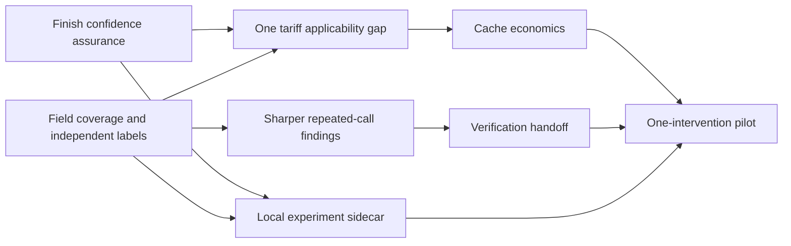

# AI cost optimization and mistake prevention: research and delivery plan

**Date:** 2026-09-22. **Status:** research recommendation; no implementation approval implied.
**Delivery baseline:** freshly fetched `origin/main`, `34867fa8515230a9c283b1d40c975dca85487633` (repository inventory: v0.11.0). The initial audit of the older checkout is retained as historical evidence; current-main reconciliation governs this plan.
**Branch:** `research/ai-cost-optimization-20260922`.

## Recommendation

Make aireceipts the local tool that answers three connected questions: **What can I trust about this cost? What should I change next? Did that change help without weakening the result?**

Build this in small increments: verify the remaining confidence acceptance work, extend existing cache details with net write-adjusted economics, sharpen repeated-failure findings, add verification chronology, then extend `compare` with explicit task outcomes. Preserve the compact receipt and its existing `--details`/JSON/handoff surfaces. The first useful release need not introduce a new command, a general event platform, or a live agent controller.

The highest-priority work is improving the reliability of existing claims. The implementation already detects repeated calls and context refill and reprices short tool-free turns. A repeated call is not necessarily a mistake; a short answer is not necessarily easy. A lower list-price estimate is not necessarily a smaller subscription bill. These distinctions determine whether users act on the product's advice.

**Recommended first two weeks:** reconcile the current Sonnet 5 and GPT-5.6 Sol price-table conflicts with dated source evidence; verify the remaining SPEC-0044 self-check acceptance evidence; audit field coverage against current provider documentation; extend the already shipped cache breakdown with one fully traceable net write-adjusted comparison where usage permits; evaluate existing repeated-call findings against independently labeled negative cases. Select the next detector from observed incidence and actionability, not a research paper's headline savings.

No actual savings, real-user false-positive rate, or productivity improvement was measured in this research. Those are deliverables of the proposed pilot, not claims this report makes.

## Research method and reading map

Three parallel agents investigated provider mechanics, failure prevention/evaluation, and market/prior art. The lead inspected current code through a freshly indexed codebase-memory graph and investigated context/tool efficiency. A second pass cross-reviewed the reports and corrected inconsistent confidence gates, an invalid overlap example, and an incorrect union-accounting invariant.

The research uses opened primary documentation, official repositories, engineering reports and research papers. Vendor capability descriptions are not hands-on competitor benchmarks; research results are bounded to their populations and setups. Access date is 2026-09-22 unless a source version is explicitly pinned. Current price pages do not establish historical effective dates.

| Read | Purpose |
|---|---|
| [Current-main reconciliation](Current%20Main%20Reconciliation.md) | Current implementations, superseded concerns and remaining scope; read first |
| [Historical implementation evidence](Codebase%20Evidence%20and%20Analytical%20Limits.md) | Initial older-checkout audit; superseded where the reconciliation says so |
| [Provider cost mechanics](Provider%20Cost%20Mechanics.md) | Model-specific billing, cache formulas, tariff observability, subscription distinctions |
| [Failure prevention and evaluation](Failure%20Prevention%20and%20Evaluation.md) | Six detector designs, adversarial negatives, causal study protocol |
| [Market and product opportunities](Market%20and%20Product%20Opportunities.md) | Ten relevant tools, differentiated user jobs, adoption pilot |

The worktree was initially created from the checked-out feature branch, then advanced to freshly fetched current main after discovering the baseline mismatch. Its research documents were preserved. The original checkout's unrelated uncommitted edits are preserved. No product code, price tables, skills, or approved spec statuses were changed.

## Findings that change the product strategy

### 1. Cost provenance is a prerequisite for optimization

Current OpenAI API caching documentation distinguishes newer models' paid cache writes from earlier behavior. Codex credit documentation separately says credit billing has no separate cache-write charge. Therefore model identity and token counts alone cannot establish what the user paid. A receipt needs a declared billing basis and must keep list-price equivalents separate from invoices and quota. [API caching](https://developers.openai.com/api/docs/guides/prompt-caching), [Codex pricing](https://learn.chatgpt.com/docs/pricing).

Current main already supports per-request context tiers, explicit Standard-API-equivalent floors, request-local identity and mixed priced/unpriced ledgers. GPT-5.5 is deliberately tokens-only because its documented session-wide tier scope cannot be established from a request or slice. The initial checkout's flat-schema concerns are superseded. The remaining task is to check current provider drift and field sufficiency while preserving that conservative contract; missing Codex cache-write usage still limits net-cache analysis.

**Product implication:** reuse the existing coverage explanation and cost-model documentation. Verify one actual remaining mismatch before proposing a change; do not rebuild billing-basis labels or context-tier infrastructure already shipped.

The current-main follow-up did find concrete price-drift candidates: repository Sonnet 5 and GPT-5.6 Sol rows exceed prices displayed in current official tables. Effective dates and promotion applicability remain unresolved; investigate before changing historical rows. The [reconciliation](Current%20Main%20Reconciliation.md) records exact values and sources. A stale higher price can undermine a Standard-equivalent floor, making this a P0 investigation.

### 2. Cache economics can reverse naive token advice

Cache reads, writes, TTLs, storage and model changes alter the economics of repeated context. Anthropic's current read ratios have model exceptions, and Google's explicit cache has storage charges. A high hit rate does not establish low total cost. [Anthropic caching](https://platform.claude.com/docs/en/build-with-claude/prompt-caching), [Google caching](https://ai.google.dev/gemini-api/docs/generate-content/caching).

**Product implication:** extend the existing read-discount/detail view with a write-adjusted same-token comparison, including negative differences when all inputs are known. Do not infer the cause of a miss from counters alone. Recommend a prefix-layout or TTL experiment only when the user's actual client exposes that control.

### 3. Verification evidence is a practical mistake-prevention feature

Observed failures, edits after checks, and unresolved reruns support useful handoff advice. They do not prove bad code or negligence. Existing long-running harness research motivates explicit progress and verification artifacts, but it does not establish that a missing check caused a particular defect. [Anthropic harness engineering](https://www.anthropic.com/engineering/effective-harnesses-for-long-running-agents).

**Product implication:** the first prevention feature can be a handoff line: “Edits followed the last recorded successful check; no later result was captured.” Stronger statements require the check's scope and revision. This helps the next session without controlling the running agent.

### 4. Context and tool-output management deserve experiments, not blanket prescriptions

The observation-masking study compared context strategies in SWE-agent across five model configurations and found substantial cost reductions in its setting. Its OpenHands probe required retuning; naive reuse of parameters degraded performance. Some cost calculations used post-hoc tariffs. This supports testing context policy, not promising the same savings to aireceipts users. [The Complexity Trap, v3](https://arxiv.org/html/2508.21433v3).

Tool design guidance similarly favors meaningful, bounded results and evaluation against real tasks. A tool that dumps a large log may create repeated context expense, but result bytes do not reveal its exact marginal token cost in later prompts. [Anthropic tool engineering](https://www.anthropic.com/engineering/writing-tools-for-agents).

**Product implication:** measure output size and repeated artifact reads first. Only estimate context replay cost when actual successive prompt evidence supports it. Offer narrow-output versus full-output as a controlled workflow experiment.

### 5. Swarms trade money, time and coverage

Anthropic's often-quoted 15× token figure compares research multi-agent systems with chat, not equivalent single-agent coding tasks. A later vulnerability-discovery study's apparent swarm advantage partly reflected broader search scope; restricting directories changed the efficiency interpretation. [Research system](https://www.anthropic.com/engineering/multi-agent-research-system), [Multi-agent study](https://www.anthropic.com/research/multiagent-systems).

**Product implication:** reuse shipped child-cost rollups and extend them only with evidenced task scope or timing analysis. Do not call overlapping reads wasted work when they could be independent review. Neither summed child time nor overlapping intervals establishes the time saved by parallelism.

### 6. Optimize accepted work, not the cheapest successful screenshot

METR's 2025 study found experienced maintainers' perceived benefits diverged from measured completion time. Its 2026 follow-up then highlighted selection and concurrency problems that limited interpretation. These studies motivate careful measurement, not a present-day verdict that coding AI is faster or slower. [2025 trial](https://metr.org/blog/2025-07-10-early-2025-ai-experienced-os-dev-study/), [2026 update](https://metr.org/blog/2026-02-24-uplift-update/).

**Product implication:** comparisons need declared tasks, consistent acceptance criteria, all attempts, and repair cost. Keep human review time separate from model charges. A passing command is only evidence for that command's scope.

### 7. Totals and generic optimization advice are already competitive markets

ccusage provides broad local reporting; Langfuse explicitly targets coding-agent workflow analysis and experiments. Other inspected tools cover local monitoring, receipts, cost provenance and native transcript analysis. “Offline,” “multi-agent,” and “shows waste” do not individually establish an exclusive market position. [ccusage](https://github.com/ccusage/ccusage), [Langfuse coding agents](https://langfuse.com/coding-agents).

**Product implication:** test demand for a compact, reproducible evidence-to-action artifact that stays local. Compete on the quality of the decision it enables and the honesty of its uncertainty. Do not race adapter counts before existing findings earn trust.

## Additional analyses: prioritized opportunity map

Priority reflects evidence, relevance and dependency, not a fabricated ROI score. “Now” means suitable for the first approved slice after the coverage audit, not already implemented.

| Priority | Analysis and user decision | Required evidence / honest output | Main counterexample or limit |
|---|---|---|---|
| P0 | **Price drift and coverage audit:** does the existing total still match its dated tariff? | Model/date/tariff applicability; priced subtotal, unpriced tokens, dropped records, duplicates | Known-event coverage is not percent of total spend known |
| P0 | **Repeated-call precision audit:** should this warning exist? | Existing inputs plus observed outcomes; count repeated attempts | Polling, deliberate replication, flaky tests, state changes |
| P1 | **Net cache economics:** are reads compensating for write/storage costs? | Disjoint usage buckets and resolved rates; arithmetic net difference | Excellent hit rate with expensive writes; missing storage lifecycle |
| P1 | **Failed-invocation episodes:** what prerequisite should I inspect? | Terminal outcome, exact command context, error evidence | Nonzero search status, expected failure, justified remote retry |
| P1 | **Verification chronology:** what should I recheck? | Observed check results and subsequent edits; scope/revision if available | External CI, docs-only change, active or truncated session |
| P1 | **Unresolved check list:** what remains open? | Failed/pending/cancelled versus later equivalent success | A narrower passing check does not close the wider failure |
| P2 | **Recovery cycles:** where did repair effort accumulate? | Failure→edit→rerun episodes; usage, outcome, timestamps | TDD and useful debugging are not waste |
| P2 | **Child spend and concurrency:** is decomposition worthwhile? | Explicit ancestry and unique usage events; interval union and aggregate time separately | Independent reviewers can justifiably read the same files |
| P2 | **Tool-result volume:** should this tool return less? | Observed bytes, truncation, exact repeats; optional recorded token count | Bytes cannot be reliably converted into dollars |
| P2 | **Compaction reacquisition:** would a better handoff help? | Explicit boundary plus reads of demonstrably unchanged artifacts | Rereading can be intentional; opaque state hides retained context |
| P2 | **Reasoning/effort profile:** which task family merits a trial? | Reported reasoning subset, effort setting, full outcome | Short visible response may require hard reasoning |
| P2 | **Workflow experiment comparison:** did one change help? | Task/revision/config sidecar, all runs and acceptance artifacts | Easier later tasks, service drift, selective omission |
| P3 | **Combined opportunity amount:** which interventions overlap? | Canonical billed components/allocation slices and explicit interaction model | Removing a call changes later context/cache; alternatives are not additive |
| P3 | **Batch/Flex eligibility:** can asynchronous work move modes? | Supported API surface, independent jobs, deadline tolerance, served tier | Interactive dependent steps are not a ready-made batch |
| P3 | **Explicit cache lifecycle:** is storage idle? | Cache creation/extension/deletion and cross-client usage evidence | One transcript cannot prove a shared cache is unused |
| P3 | **Local longitudinal change detection:** did a configuration change coincide with a shift? | Versioned local runs, task mix, common price basis, declared config changes | Correlation and cohort drift; do not blame a model or person |

Expose capabilities per adapter. A missing field should disable the corresponding strong claim without disabling unrelated analysis. Begin where reliable fields already exist, instead of promising identical depth across every vendor. Cost-shape facts (pre-edit share, concentration, late-turn ratio), same-file rereads, child rollups, cache details, evidence-to-rule handoffs and nonadditive pattern subtotals already exist on main. Rows above are extension/evaluation opportunities where those capabilities overlap, not proposals to rebuild them.

## Accounting and comparison rules

### Separate four kinds of number

1. **Observed usage:** vendor counters with source references and documented normalization.
2. **Priced/allocated spend:** dated applicable rates applied to usage, with billing basis and allocation method.
3. **Arithmetic scenario:** same observed volume repriced under explicit assumptions; not a task-performance prediction.
4. **Measured intervention difference:** a comparison of actual runs under a declared study design and acceptance criterion.

Never sum across those categories as “total savings.” Subscriptions require token/quota observations and a list-price-equivalent label where appropriate. Unknown discounts, service tiers or omitted charges can make the direction of error unknown; reserve `≥` for a justified lower bound.

### Cache formula

For uncached tokens `U`, cache reads `R`, writes `Wt`, rates `pU`, `pR`, `pWt`, and output `O` at `pO`:

`token_cost = (U*pU + R*pR + Σ(Wt*pWt) + O*pO) / 1,000,000`

The buckets must be disjoint. Reasoning tokens already included in output are not added again. Storage/tool charges are separate observed components. The same-token input-price difference versus uncached input is:

`cache_difference = [R*(pU-pR) - Σ(Wt*(pWt-pU))] / 1,000,000`

This can be negative. Do not derive it by subtracting two lower-bound receipt totals: their difference has no guaranteed bound. Require a common complete component set; Codex's absent write counters prevent an exact net-cache claim. For one prefix written once then fully read `N-1` times, caching beats repeated ordinary input if `N > (w-r)/(1-r)`, assuming `r<1`, fixed rates, no eviction/rewrite/storage, identical usage and no quality change. The full derivation and TTL caveats are in the provider report. This is arithmetic, not an instruction to increase request count.

### Cheaper-model escalation formula

For an illustrative policy that always tries a cheaper run costing `c`, then escalates with probability `q` to an additional run costing `e`, expected model cost is `c + q*e`, plus observed switching/recovery costs. Compare it to a strong-only policy's full expected cost, including that policy's own failures. Do not assume either policy has equal acceptance or that a failed cheap attempt leaves no state to repair.

Using hypothetical cost units, `c=2,e=10,q=0.4` gives 6 units before other costs; `q=0.9` gives 11. This illustrates why per-token price is insufficient, not an empirical forecast. A retrospective short-output heuristic cannot supply `q`.

### Cohort objective

`cost_per_accepted_task = total_cost_of_all_assigned_attempts / accepted_tasks`

Include abandoned runs, failed retries, children and subsequent repair within the predeclared observation window. When no tasks are accepted, the ratio is undefined. Show acceptance rate, sample count, unresolved prices, total spend and review time alongside it. If price coverage is incomplete, do not silently treat the subtotal as the whole cost. Keep all assigned attempts in primary outcome and missingness reporting, using token-based descriptions where appropriate. Any restricted priced cohort is descriptive or sensitivity analysis unless eligibility was fixed before assignment; it cannot alone support a causal savings claim.

### Overlap

Keep the existing maximum-class flagged-pattern subtotal, non-additive warnings and separate scenarios first. Only add a combined amount if users need it and the semantics are supportable. A future union operates on usage-event, billed-component and allocation-slice identities. Adding identical/subset coverage changes nothing; adding partially overlapping coverage adds only newly covered atoms. Repricing a removed turn and saving its cache reads cannot be counted twice.

## Concrete delivery backlog

These are proposal IDs, not new SPEC numbers. Each nontrivial implementation needs the normal draft-spec/maintainer approval path. Estimated effort is hands-on engineering time for one maintainer with agent assistance, excluding review queues and corpus recruitment; it is not a commitment.

| Work item | Scope and owners by area | Estimate / dependency | Acceptance and stop condition |
|---|---|---|---|
| R0 — Verify remaining assurance | Reconcile SPEC-0044 acceptance evidence with existing cost-model docs and self-check; discovery fix SPEC-0045 is already shipped | 1–2 days audit; implementation only if a real gap remains | Existing independent manifests and real-PR dogfood evidence; do not rebuild documentation or discovery handling |
| R1 — Field coverage and independent labels | Adapter capability matrix; consented sample; labels authored without detector output; evaluation owner | 2–3 days plus recruitment; parallel with R0 | Per-field denominators, positive and negative examples, unknowns by adapter; no new detector if incidence or data is absent |
| R2 — Current tariff/usage conformance | Reconcile Sonnet 5 / GPT-5.6 Sol current-table conflicts and dated applicability using existing PricingUnit/context-tier/CostEstimate contracts | 1–2 days audit; 2–3 more only for a demonstrated gap; R0/R1 | Existing floors and unknowns preserved; no new schema if current contract suffices; Codex absent writes remain unknown |
| R3 — Net cache delta | Extend shipped cache detail/read-discount view with write-adjusted arithmetic for one sufficiently observed case, likely Claude direct API-equivalent usage | 2–4 days; R2 | Positive/negative/unknown examples; missing writes/storage suppress net claims; existing receipt bytes change only via approved goldens |
| R4 — Existing-loop precision | Carry outcomes/evidence through existing detector; narrow semantics, polling negatives; `src/pricing/waste.ts` | 2–4 days; R1, may parallel R2 | Zero observed false waste labels on held-out negatives; preserve neutral repeated-call facts; suppress noisy classes |
| R5 — Verification handoff | One recognized command family, chronology plus scope; extend handoff/export | 3–5 days; R1/R4 evidence work | Edits-after-check and unresolved result examples; outside-CI/active-session negatives; abstain on incomplete scope |
| R6 — Experiment sidecar | Small local manifest imported by `compare`, all attempts and acceptance evidence | 3–5 days; R0/R1; pilot after R3/R5 | A developer can compare one intervention without running models through aireceipts; reject automatic unrelated-task matching |
| R7 — Pilot and decision | Existing receipt versus one actionable finding; reviewed local summaries | 2–4 elapsed weeks; R3 or R5 and R6 | Practical effect plus quality constraint, no excluded failures; inconclusive remains inconclusive; cut features users do not act on |

Do not parallelize edits to shared normalized types and receipt contracts blindly. One owner checks the existing contract, then pricing and detector work can proceed with separate fixtures; add fields only when demonstrably absent. Reuse one renderer, one price schema, one confidence mechanism and existing overlap flags. The current waste implementation is `src/pricing/waste.ts`; a skill's generic proposed directory is not evidence that a registry already exists.



### First five working days

**Day 1:** read the current-main reconciliation and investigate the two price-drift candidates; verify the remaining SPEC-0044 acceptance items without duplicating shipped docs or SPEC-0045; produce a coverage worksheet for model/date, raw/final usage semantics, cache tiers, tool outcome, edit scope and ancestry. Separate supported from assumed fields. Confirm the exact user decision for the first slice.

**Day 2:** label a pilot sample of roughly 30 candidate episodes plus clean negative sessions, spanning API and subscription usage where available. This is qualitative scoping, not precision certification. Establish a disjoint holdout and record missing fields. Real data stays local; no raw content enters telemetry or public fixtures.

**Day 3:** reproduce one remaining applicability or net-cache insight gap with a sanitized independent fixture and write a narrow draft spec. If current conformance is already correct, proceed directly to the net-cache extension. In parallel, record legitimate repeated-call counterexamples. Do not change prices through uncited inference.

**Day 4:** after spec approval, implement only the selected extension, run the repository gates and money-path mutation checks required by scope. Reuse existing cache detail output and prototype net arithmetic only for supported inputs. No approval is presumed by this plan.

**Day 5:** demonstrate a traceable receipt and a negative/unknown case to pilot users; test whether they understand the amount and next action. Choose R3 or R5 based on actionable incidence. If neither has adequate evidence, improve coverage/wording instead of building another heuristic.

### Four-to-eight-week decision sequence

Week 1 establishes trust and data sufficiency. Weeks 2–3 ship at most one approved insight slice and a narrower existing loop rule. Week 4 pilots the sidecar and handoff with users. Weeks 5–8, if recruitment and task volume permit, run a preregistered intervention study and decide whether to expand. A calendar deadline never overrides insufficient evidence or spec approval.

## Product value and reliability gates

Use three gates with different purposes; do not confuse them.

**Arithmetic correctness:** supported rows and normalized usage reconcile; unknown pricing never silently becomes a known zero (omitted components retain tokens and caveats within an explicitly qualified floor); identical inputs and pinned versions produce byte-identical output. Goldens protect all existing surfaces. Monetary changes retain property/mutation testing. Include threshold boundaries, cache write/read subsets, duplicated streaming usage, partial transcripts and ancestry overlap.

**Finding reliability:** default “waste” or causal labels require near-zero false positives, as the repo already mandates. Require zero observed false waste labels in independent held-out negative cases and no unresolved severe mislabel. A proposed quantitative target is a one-sided 95% precision lower bound of at least 99%, with cluster-aware uncertainty and meaningful coverage. With ideal independent observations, roughly 299 all-correct emitted labels would be needed for that bound; correlated sessions require more evidence or a different cluster-aware analysis. This is not a promise that 299 labels suffice in practice. A 30-case pilot cannot certify it. When evidence is too small, ship exact arithmetic and neutral chronology in opt-in details, not a confident waste accusation.

**Intervention value:** predeclare a minimum meaningful cost reduction and acceptable quality noninferiority margin for the task family. Require uncertainty bounds to clear both, and no material increase in review burden or escaped defects. A nonsignificant quality difference does not establish safety. Keep failed/abandoned attempts in the assigned cohort, audit graders, and use a fixed analysis plan or valid sequential method. The failure-prevention report gives the full protocol.

For onboarding, start with a 12-person qualitative pilot across API and subscription users. Proposed targets: 8 unassisted first receipts, 6 evidence inspections, 4 completed workflow experiments, 3 returning users in week two. These are early product signals, not a powered savings study. Record why people do not act: unsupported recommendation, unclear evidence, unavailable setting, or effort exceeding value.

SPEC-0081's rejected automatic-conversion proposal is not revived here: observe existing onboarding and classify demonstrated failure reasons before proposing a funnel change. The final study sample size depends on pilot variance and clustering. Randomize persistent advice at developer level where feasible; task-level randomization can contaminate controls as users learn the advice. For offline harness comparisons, pair task snapshots, randomize order and retain all runs. No paid model trials are part of this research; a future trial needs its own budget and execution scope.

## How the product can prevent mistakes without becoming an agent controller

Use the already shipped session-end, handoff and PR surfaces. Show the strongest supported actionable observation, with an evidence reference and specific scope. Example wording below is illustrative proposed behavior, not current CLI output:

```text
Verification evidence
  Last recorded passing check: unit tests, before the final edit
  Later equivalent result: not captured
  Next step: check the edited scope before relying on that pass

Cost basis
  API list-price equivalent; subscription invoice not determined
  Cache writes and reads: included where reported and priced
  Missing tariff dimension: exact total unavailable
```

Avoid a wall of warnings or a score that hides unknowns. “No finding supported” should be a valid result. Product recommendations should be bounded and derived from captured facts; do not automatically execute commands extracted from untrusted transcripts, rewrite agent instructions, cancel processes, change providers, or reduce verification.

A future live advisory hook could be deterministic and local, but it changes the product's role and needs its own architecture decision, budget behavior, latency bounds and false-alert study. Hard stops and automatic model routing are further separate proposals. They are not necessary to deliver useful mistake prevention through the next handoff.

## Deliberately deferred

- Universal “optimal model” recommendations, model rankings or claims another model would have solved a task.
- A general billing/observability platform, hosted dashboards, account collection or transcript uploads.
- Full prompt reconstruction, semantic failure diagnosis or LLM judges inside the product.
- Batch/Flex recommendations for interactive sessions without workload eligibility evidence.
- Automatic deletion of provider caches or modification of user workflows.
- A headline summed “potential savings” number from overlapping scenarios.
- Dollar-per-line-of-code, agent leaderboards, and a productivity score that rewards fewer checks.
- Broad adapter expansion before evidence depth proves useful to existing users.

OpenTelemetry naming may inform optional local interoperability, but its GenAI conventions have moved to a dedicated repository. Pin a version if reused; do not import a telemetry exporter or recreate the full tracing stack merely to align names. [Official conventions repository](https://github.com/open-telemetry/semantic-conventions-genai).

## Constraints preserved

I1: deterministic analysis, no model calls or new product-path network. I2: dated applicable price evidence or tokens/explicit unknown. I3: traceable numbers and clearly labeled arithmetic/inference. I4: local evidence; existing disclosed opt-out telemetry only, no raw transcripts, commands, paths, costs or content hashes. I5: shared byte-stable receipt contract and goldens. I6: session/workflow facts and measured comparisons, no model/agent rankings.

Maintainer control over spec approval, skill changes, cited price-table changes and releases remains intact. This report selects work and proposes gates; it does not self-approve specifications or authorize a release.

## Deliverable boundary

The recommended sequence is concrete enough to draft the first narrow spec: verify remaining confidence acceptance evidence and extend the current cache details with a supported net price difference, with an independent evidence corpus alongside it. The important unknown is not the number of possible features; it is which observations are present often enough, accurate enough and actionable enough to improve a real user's next session.

Baseline and document verification results are recorded in [Validation and review](Validation%20and%20Review.md). The complete research bundle is also copied to the work Obsidian vault under `Research/AI Cost Optimization and Mistake Prevention/`.
